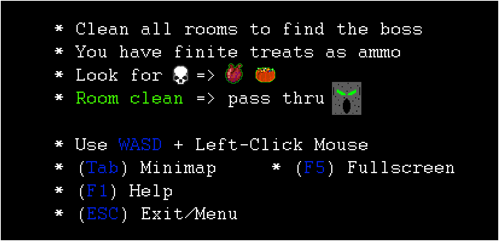
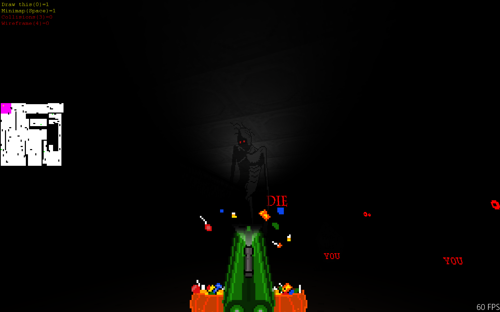
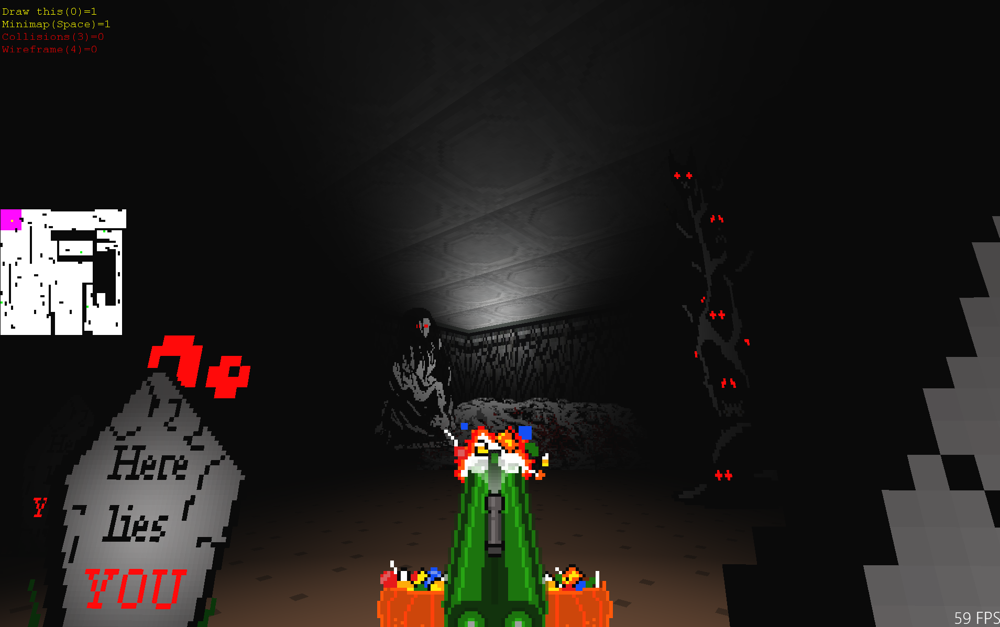

Spooky 
=======
Manu Marin 
Game from scratch in c++/directx11/uwp for a one-month game jam, halloween themed.

October 31st 2016

GAME
====
* First Person Shooter
* Kill all enemies with treats and candies, room-by-room to open it up
* When the room opens, you can hear a sound and the doors turns green, you can pass thru.
* When all rooms are open, a boss will appear (see the dark red room in the minimap) and 
	you'll have to defeat it. It's a bit hard!

Link to a video here (OneDrive): <a href="https://1drv.ms/v/s!AqR438sIm84LgTush8RGbR0C9jQQ">video</a>
    
INSTALL
=======
* This Appx bundle is not signed for Store, but for Test/Developer.
* Right-click on Add-AppDevPackage.ps1 and "Run with Powershell" (Admin mode)
* Or double-click on .appxbundle if you have certificates installed already
	
ASSETS
======
- Code, design, sprites, texture, effects by myself
- Sounds created with Bfxr
- Other sounds from Freesounds.org (see sounds.txt)
- Main title font by http://www.fontspace.com/cloutierfontes

CONTROLS
========
* Mouse and Left-Click to look and shoot
* WASD 	- For movement

* F1 	- Help screen
* F5 	- Toggle Fullscreen
* Tab 	- Toggle Minimap
* Esc 	- Exit or Menu

TOOLS
=====
* Microsoft Visual Studio 2015 Community Edition
* C++ / DirectX11 / DirectXTK (I started from scratch using the DX Sample)
* The code does not use any lib or code from any other library
* GraphicsGale + Paint.net for sprites
* https://twistedwave.com/online/# for sound editing

POSTMORTEM
==========
Technical:
- It randomly generates all rooms using BSP trees. Randomly generate room-profiles.
- Only renders/update the room you are
- BSP Portals were generated but does not make use of it in runtime.
- Technically it is 2D (for collision/intersection against level). 3D for shotgun bullets. 
- Spotlight effect achieved tweaking exp fog density depending on where pixel is
- 3 Pixel Shaders / 2 Vertex Shaders
- Uses DirectXTK lib for Audio, Input.

What was right:
- Reducing scope at right time
- Not overengineering
- Not making an engine but a game. Forgetting about internal code quality (ugly code). Just one month.
- Not data driven, all hardcoded. Iteration times were fast enough.

What was wrong:
- I made everything and spent more time on core than gameplay
- On-the-fly design changes during development
- Random level generation. It took too much time specially make all rooms connected.
	- Sometimes there are room clusters disconnected and some teleports are created

ORIGINAL IDEAS
==============
* Originally it was going to be a light RPG where you fight against bourocracy and other issues as an adult.
* Due 5-minutes rule, I changed the design
* The second design was a FPS but more focused on Mental Illness enemies (for awareness). Original ways to kill those ones.
* Due time-constraint I changed a little de design as I wasn't sure if I was going to achieve a fun experience doing that.

KNOWN ISSUES
============
- Some rooms can be generated disconnected. It's a major issue, but happens few times. Restart then.
	- Algorithm to find disconnected clusters has some bug.
	
- Bad performance on Fullscreen on huge target sizes (4K)
	- Because the game RenderTarget is created out of actual Target and the Pixel Shader is unoptimized

	
-Manu
gyakoo@gmail.com
